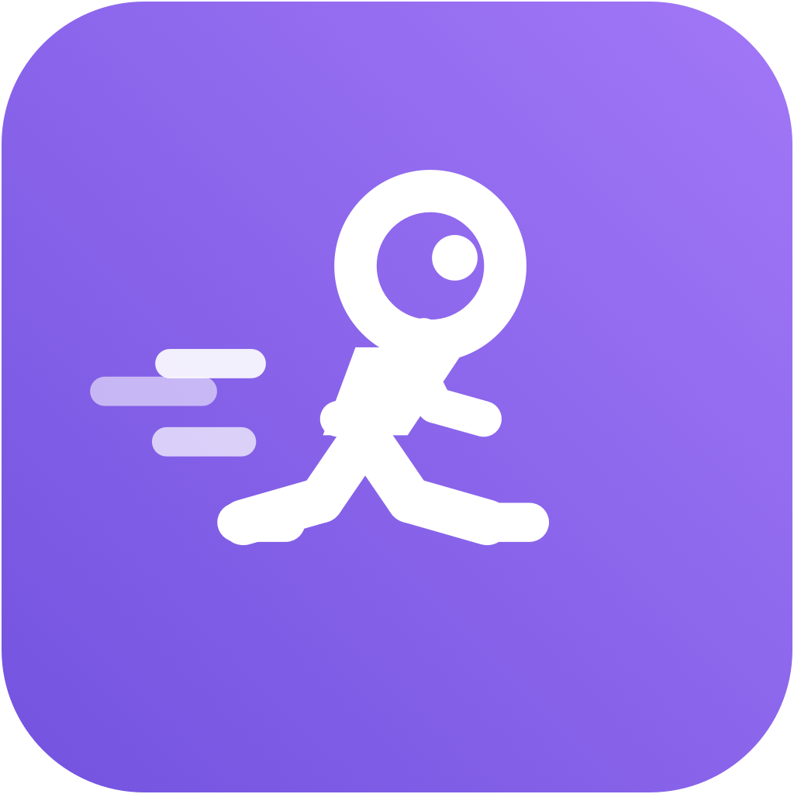
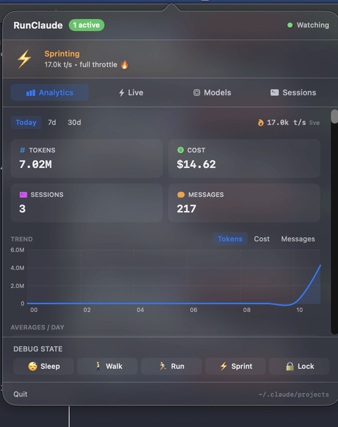

# RunClaude

<p align="center">
  
</p>

<p align="center">
  
</p>

Menu bar analytics for [Claude Code](https://docs.anthropic.com/en/docs/claude-code). A pixel bot runs faster as your token burn rate climbs — inspired by [RunCat](https://kyome.io/runcat/).

Click the icon for a live dashboard: token spend, cost, session history, and per-minute burn across all active sessions.

## Install

```sh
git clone https://github.com/ocodista/RunClaude.git
cd RunClaude/app
./build.sh
cp -R build/RunClaude.app /Applications/
open /Applications/RunClaude.app
```

## Features

- **Bot states** — sleeps, walks, runs, sprints, or locks behind bars when rate-limited
- **Analytics** — tokens, cost, sessions, and messages for Today / 7d / 30d
- **Trend chart** — hourly buckets for today, daily for longer ranges
- **Live tab** — per-session pulsing cards with per-minute token comparison chart
- **Top tools / skills / commands** — see what Claude is actually doing
- **Participation** — human vs agent % per session
- Reads `~/.claude/projects/` directly — zero config, no network
- Single Swift binary, no daemon, no Xcode required

## Requirements

- macOS 14+
- Xcode command line tools (`xcode-select --install`)

## Development

```sh
./start.sh  # builds and opens from app/build/
```

## Architecture

- `BurnRateEngine.swift` — token aggregation, snapshot publishing
- `SessionScanner.swift` — tails JSONL files with incremental offsets (2s poll)
- `BotRenderer.swift` — NSBezierPath pixel bot drawing
- `BotAnimator.swift` — state machine (sleeping → walking → running → working → locked)
- `StatsStore.swift` — persistent daily stats to disk
- `PopoverView.swift` — SwiftUI analytics dashboard

## License

MIT
